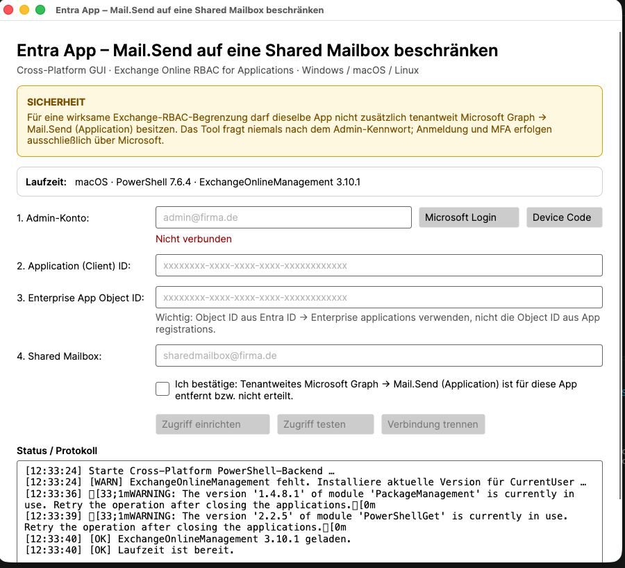
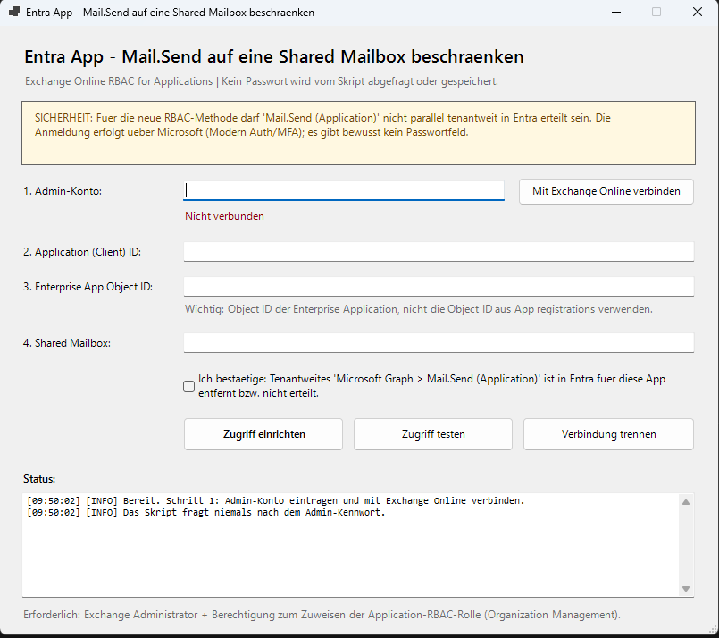

# Entra Mail.Send – Shared Mailbox RBAC Tool

**Language / Sprache:** 🇬🇧 English · [🇩🇪 Deutsch](README.md)


An admin tool for granting a **Microsoft Entra Enterprise Application** the Exchange Online role **`Application Mail.Send`** for **exactly one Shared Mailbox**.

The repository contains three variants:

- **Cross-Platform GUI (Avalonia)** – Windows, macOS and Linux, with a built-in **German / English language switch**
- **Windows PowerShell GUI** – classic Windows Forms interface
- **Cross-Platform CLI** – PowerShell menu for Windows, macOS and Linux

All variants use **Exchange Online RBAC for Applications**. The tool does **not** request or store the admin password.

> [!IMPORTANT]
> For the restriction to be effective, the same app must **not also have tenant-wide Microsoft Graph → `Mail.Send (Application)`** granted in Microsoft Entra. Entra application permissions and Exchange Application RBAC are additive.

## Screenshots

### macOS – Cross-Platform GUI



### Windows – PowerShell GUI



## Language

The **Cross-Platform GUI** has a language selector in the upper-right corner:

- **Deutsch**
- **English**

Changing the language updates the interface as well as the status and error messages returned by the Exchange backend.

## What does the tool do?

The tool guides an administrator through the required Exchange Online steps:

- checks or installs `ExchangeOnlineManagement`
- connects using `Connect-ExchangeOnline`
- uses Microsoft Modern Authentication / MFA / Conditional Access
- never asks for the admin password
- validates that the target is a Shared Mailbox
- creates the Exchange reference to the Entra service principal if required
- creates a Management Scope for exactly that Shared Mailbox
- assigns `Application Mail.Send` to that scope
- validates authorization with `Test-ServicePrincipalAuthorization`
- detects additional Exchange RBAC assignments that could widen Mail.Send access

## Architecture

```text
Microsoft Entra Enterprise Application
                 │
                 ▼
       Exchange Service Principal
                 │
                 ▼
        Application Mail.Send
                 │
                 ▼
          Management Scope
                 │
                 ▼
        one Shared Mailbox
```

The Cross-Platform GUI uses:

```text
Avalonia GUI (.NET 10)
        │
        ▼
persistent PowerShell 7 worker
        │
        ▼
ExchangeOnlineManagement
        │
        ▼
Exchange Online RBAC
```

## Requirements

### General

- existing Microsoft Entra App / Enterprise Application
- existing Shared Mailbox in Exchange Online
- internet access to Microsoft 365 and, if required, PowerShell Gallery
- **Exchange Administrator** in Microsoft Entra ID
- permission to assign Exchange Application RBAC roles

### Cross-Platform GUI

- Windows, macOS or Linux
- **.NET 10 SDK**
- **PowerShell 7.4 or newer** with `pwsh` available in `PATH`

## Quick start – macOS

Check the prerequisites:

```powershell
pwsh --version
dotnet --version
```

Start the GUI from the repository:

```powershell
pwsh ./CrossPlatformGUI/scripts/run-source.ps1
```

Or start it directly:

```bash
dotnet run --project CrossPlatformGUI/EntraMailSendRbac.Gui/EntraMailSendRbac.Gui.csproj
```

A native desktop window will open on macOS. Select **English** in the upper-right corner if needed.

### Build a local macOS app

```bash
chmod +x ./CrossPlatformGUI/scripts/build-macos-app.sh
./CrossPlatformGUI/scripts/build-macos-app.sh
```

The app will be created at:

```text
CrossPlatformGUI/dist/Entra MailSend RBAC.app
```

> [!NOTE]
> The local build is not Apple codesigned or notarized. Codesigning and notarization should be added before public distribution.

## Quick start – Windows

### Recommended: Cross-Platform GUI

```powershell
pwsh .\CrossPlatformGUI\scripts\run-source.ps1
```

Then select **English** in the upper-right corner.

### Classic Windows PowerShell GUI

```powershell
.\Entra-MailSend-SharedMailbox-RBAC-GUI.ps1
```

If the local execution policy blocks the script, you can use a process-only bypass:

```powershell
Set-ExecutionPolicy -Scope Process -ExecutionPolicy Bypass
.\Entra-MailSend-SharedMailbox-RBAC-GUI.ps1
```

## Using the Cross-Platform GUI

1. Select **Deutsch** or **English** in the upper-right corner.
2. Enter the **Admin account**.
3. Choose **Microsoft Login**. If browser sign-in does not work, use **Device Code**.
4. Enter the **Application (Client) ID**.
5. Enter the **Enterprise App Object ID**.
6. Enter the **Shared Mailbox**.
7. Confirm that tenant-wide Microsoft Graph `Mail.Send (Application)` is removed or not granted.
8. Select **Configure access**.
9. The tool automatically performs an access test.

## Required IDs

### Application (Client) ID

The Application ID of the Entra app.

### Enterprise App Object ID

Use the Object ID of the **Enterprise Application / service principal**.

> [!WARNING]
> Do not use the Object ID from **App registrations**. Use the Object ID from **Entra ID → Enterprise applications → application**.

## Security

The tool is intentionally designed so that it does not handle sensitive credentials itself:

- no password field
- no storage of admin passwords
- no storage of client secrets
- no storage of OAuth tokens by the tool
- authentication through `Connect-ExchangeOnline`
- MFA / Passkeys / Conditional Access remain part of the Microsoft sign-in flow

Before production use, test the configuration with a test app and test Shared Mailbox.

## Why Exchange Online RBAC for Applications?

Exchange Online RBAC for Applications allows application permissions to be combined with an Exchange resource scope. This makes it possible to grant `Mail.Send` to an app without granting it across every mailbox in the organization.

For new implementations, this is the modern alternative to older **Application Access Policies**.

## Troubleshooting

### `pwsh` is not found

```bash
which pwsh
pwsh --version
```

PowerShell 7 must be available in `PATH`.

### .NET SDK is not found

```bash
dotnet --version
```

The current GUI project targets **.NET 10**.

### Microsoft Login does not open

Use **Device Code** in the Cross-Platform GUI.

### Access works outside the intended Shared Mailbox

Check whether:

- tenant-wide `Mail.Send (Application)` is still granted in Entra
- another Exchange RBAC assignment such as `Application Mail.Send`, `Application Mail Full Access`, or `Application Exchange Full Access` exists

## Microsoft documentation

- [Role Based Access Control for Applications in Exchange Online](https://learn.microsoft.com/en-us/exchange/permissions-exo/application-rbac)
- [Connect-ExchangeOnline](https://learn.microsoft.com/en-us/powershell/module/exchangepowershell/connect-exchangeonline)
- [Test-ServicePrincipalAuthorization](https://learn.microsoft.com/en-us/powershell/module/exchangepowershell/test-serviceprincipalauthorization)
- [About the Exchange Online PowerShell module](https://learn.microsoft.com/en-us/powershell/exchange/exchange-online-powershell-v2)
- [Avalonia supported platforms](https://docs.avaloniaui.net/docs/supported-platforms)

## Disclaimer

This project is not an official Microsoft product. Use it at your own risk. Changes to production Exchange / Entra permissions should be tested in advance and reviewed according to the least-privilege principle.
